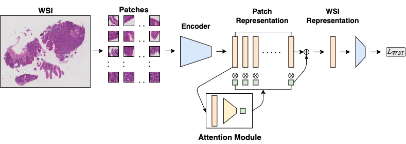

# HistoTransfer

## Introduction

Implementation of HistoTransfer: Understanding Transfer Learning for Histopathology

    

    

## Abstract

Advancement in digital pathology and artificial intelligence has enabled deep learning-based computer vision techniques for automated disease diagnosis and prognosis. However, WSIs present unique computational and algorithmic challenges. WSIs are gigapixel-sized, making them infeasible to be used directly for training deep neural networks. Hence, for modeling, a two-stage approach is adopted: Patch representations are extracted first, followed by the aggregation for WSI prediction. These approaches require detailed pixel-level annotations for training the patch encoder. However, obtaining these annotations is time-consuming and tedious for medical experts. Transfer learning is used to address this gap and deep learning architectures pre-trained on ImageNet are used for generating patch-level representation. Even though ImageNet differs significantly from histopathology data, pre-trained networks have been shown to perform impressively on histopathology data. Also, progress in self-supervised and multi-task learning coupled with the release of multiple histopathology data has led to the release of histopathology-specific networks. In this work, we compare the performance of features extracted from networks trained on ImageNet and histopathology data. We use an attention pooling network over these extracted features for slide-level aggregation. We investigate if features learned using more complex networks lead to gain in performance. We use a simple top-k sampling approach for fine-tuning framework and study the representation similarity between frozen and fine-tuned networks using Centered Kernel Alignment. Further, to examine if intermediate block representation is better suited for feature extraction and ImageNet architectures are unnecessarily large for histopathology, we truncate the blocks of ResNet18 and DenseNet121 and examine the performance.
